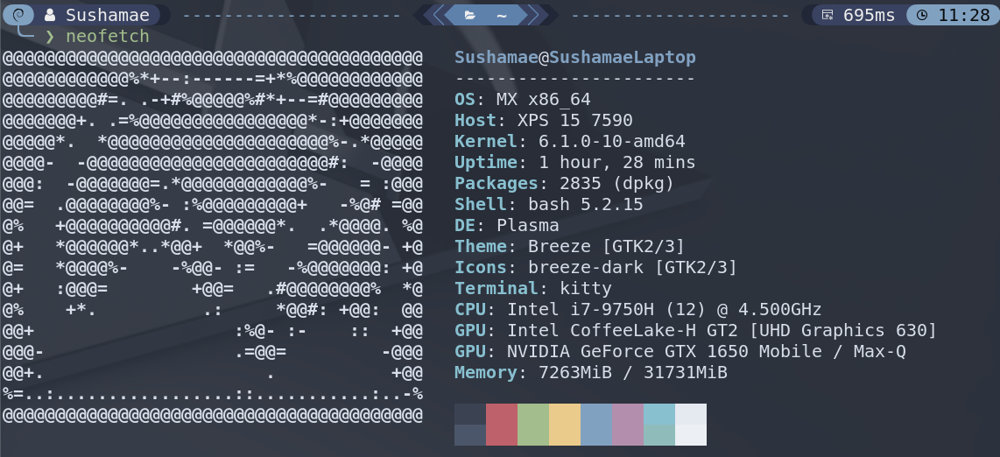

# Sushamae Terminal Profile



This is the current profile I use for my UNIX terminals. I have only used this on the default Ubuntu terminal.

## Prerequisites

Before using the scripts, I typically like to update, upgrade and install the necessary software (git and neovim).

```bash
# Update your software repositories.
sudo apt-get update
sudo apt-get upgrade -y

# Install Git.
sudo apt-get install -y git

# Install NeoVim v9.0
chmod u+x extras/nvim.appimage && ./extras/nvim.appimage
```

## Installation

Install [logo-ls](https://github.com/Yash-Handa/logo-ls) (Icons in terminal):

```bash
cp extras/logo-ls /usr/local/bin
```

Install a [Nerd Font](https://www.nerdfonts.com/) (HackFont):

```bash
./install_fonts.sh
```

Install [ZSH](https://github.com/ohmyzsh/ohmyzsh/wiki/Installing-ZSH)

```bash
./install_zsh.sh
```

Add the rest of the installation scripts

## 💤 LazyVim

I use [LazyVim](https://github.com/LazyVim/LazyVim) as my NeoVim configuration ([One Dark Pro Themed](https://github.com/olimorris/onedarkpro.nvim)).


If you want to don't use my configurations, you can skip this.

#### NOTE:

Backup your current NeoVim files if you want to keep your configurations.

```bash
# required
mv ~/.config/nvim ~/.config/nvim.bak

# optional but recommended
mv ~/.local/share/nvim ~/.local/share/nvim.bak
mv ~/.local/state/nvim ~/.local/state/nvim.bak
mv ~/.cache/nvim ~/.cache/nvim.bak
```

Copy files to the nvim directory.

```bash
# Copy NeoVim Configurations
cp -r lazyvim_configs/* ~/.config/nvim
```

## Source/References

Links to some of the resources I used:

[Oh My Zsh!](https://medium.com/wearetheledger/oh-my-zsh-made-for-cli-lovers-installation-guide-3131ca5491fb) | [Robby Russel OMZ](https://github.com/robbyrussell/oh-my-zsh) | [NeoVim V0.9.0](https://github.com/neovim/neovim/releases/tag/v0.9.0) | [LazyVim Documentation](https://lazyvim.github.io/installation)
